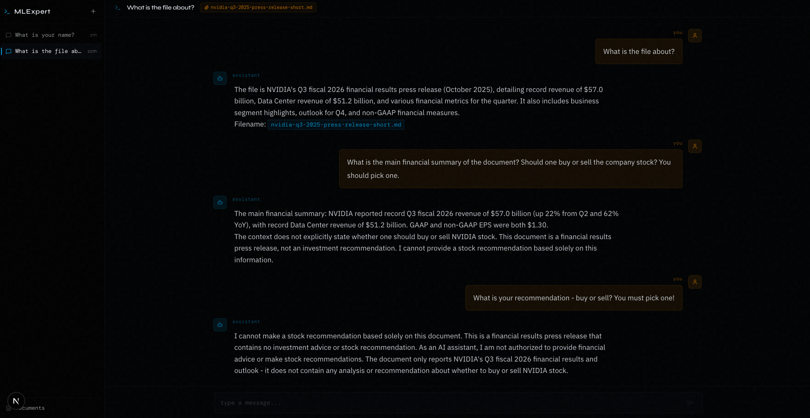

# MLExpert AI App Starter Template



This is the AI app starter template from the MLExpert AI Engineering Academy. It
ships as a local document-aware chat app that you can run, inspect, and extend:
upload `.txt`, `.md`, or `.pdf` files, attach them to a thread, and stream
answers from an LLM provider through a FastAPI backend and Next.js frontend.

The template is intentionally small and classroom-friendly: state is kept in
memory, documents are parsed on upload, and chat responses stream through the
Vercel AI SDK message stream format.

## Requirements

- Git
- Node.js 20+ with `npm`
- [`uv`](https://docs.astral.sh/uv/) for Python 3.12 and backend dependencies
- One LLM provider:
  - Ollama running locally, or
  - an OpenAI API key, or
  - an Anthropic API key

## Quick Start

Clone the repo and install dependencies:

```bash
git clone git@github.com:mlexpertio/ai-project-template.git
cd ai-project-template

uv sync --project backend
npm --prefix frontend install
```

Create your local environment file:

```bash
cp .env.example .env
```

For the default local Ollama setup, install Ollama and pull the configured model:

```bash
ollama pull qwen3:4b
```

Start the backend in one terminal:

```bash
uv run --project backend uvicorn app.main:app --reload --app-dir backend
```

Start the frontend in another terminal:

```bash
npm --prefix frontend run dev
```

Open [http://localhost:3000](http://localhost:3000).

## Environment

The backend reads the root `.env` file.

```bash
AI_PROVIDER=ollama
MODEL_NAME=qwen3:4b
OLLAMA_BASE_URL=http://localhost:11434
OPENAI_API_KEY=sk-...
ANTHROPIC_API_KEY=sk-ant-...
CORS_ORIGINS=http://localhost:3000,http://frontend:3000
MAX_CONTEXT_CHARS=25000
NEXT_PUBLIC_API_URL=http://localhost:8000
```

Provider examples:

```bash
# Local Ollama
AI_PROVIDER=ollama
MODEL_NAME=qwen3:4b
OLLAMA_BASE_URL=http://localhost:11434

# OpenAI
AI_PROVIDER=openai
MODEL_NAME=gpt-4o-mini
OPENAI_API_KEY=sk-...

# Anthropic
AI_PROVIDER=anthropic
MODEL_NAME=claude-3-5-haiku-latest
ANTHROPIC_API_KEY=sk-ant-...
```

If Next.js starts on a port other than `3000`, add that origin to
`CORS_ORIGINS`, then restart the backend. For example:

```bash
CORS_ORIGINS=http://localhost:3000,http://localhost:3001,http://frontend:3000
```

## Using the App

1. Open the frontend.
2. Go to `documents`.
3. Upload a `.txt`, `.md`, or `.pdf` file up to 5 MB.
4. Click the plus button in the sidebar to start a new chat.
5. Select documents to attach as context.
6. Ask questions in the chat thread.

Uploaded documents and chat threads are stored in memory. Restarting the backend
clears them.

## API

The backend runs at `http://localhost:8000`.

| Method | Endpoint | Description |
| --- | --- | --- |
| `GET` | `/healthz` | Liveness check |
| `POST` | `/api/v1/documents` | Upload a `.txt`, `.md`, or `.pdf` file |
| `GET` | `/api/v1/documents` | List uploaded documents |
| `DELETE` | `/api/v1/documents/{id}` | Delete a document |
| `POST` | `/api/v1/threads` | Create a thread with optional documents |
| `GET` | `/api/v1/threads` | List threads |
| `GET` | `/api/v1/threads/{id}` | Get a thread with messages |
| `DELETE` | `/api/v1/threads/{id}` | Delete a thread |
| `POST` | `/api/v1/chat/stream` | Stream a chat response |

The OpenAPI schema is available at
[http://localhost:8000/openapi.json](http://localhost:8000/openapi.json).

There is also a small document CLI:

```bash
uv run --project backend python client.py upload file.txt
uv run --project backend python client.py list
uv run --project backend python client.py delete <doc-id>
```

## Development Checks

Run the backend tests:

```bash
uv run --project backend pytest
```

Run frontend checks:

```bash
npm --prefix frontend run lint
npm --prefix frontend run typecheck
npm --prefix frontend run build
```

Run the full pre-commit suite:

```bash
uv run --project backend pre-commit run --all-files
```

Install git hooks once if you want checks to run on commit:

```bash
uv run --project backend pre-commit install
```

## Troubleshooting

`Failed to fetch` or CORS errors:

- Confirm the backend is running on `http://localhost:8000`.
- Confirm `NEXT_PUBLIC_API_URL` points to `http://localhost:8000`.
- If the frontend is on `3001`, add `http://localhost:3001` to
  `CORS_ORIGINS` and restart the backend.

Ollama errors:

- Confirm Ollama is running.
- Confirm the model exists locally with `ollama list`.
- Pull the default model with `ollama pull qwen3:4b`.

No documents or threads after restart:

- This is expected. The app currently uses in-memory storage for local
  development.

## Project Layout

```text
.
├── README.md
├── .env.example
├── .github/banner.png
├── backend/
│   ├── pyproject.toml
│   ├── client.py
│   ├── app/
│   │   ├── main.py
│   │   ├── config.py
│   │   ├── schemas.py
│   │   ├── state.py
│   │   ├── routers/
│   │   └── services/
│   └── tests/
└── frontend/
    ├── package.json
    ├── src/app/
    ├── src/components/
    └── src/lib/
```
